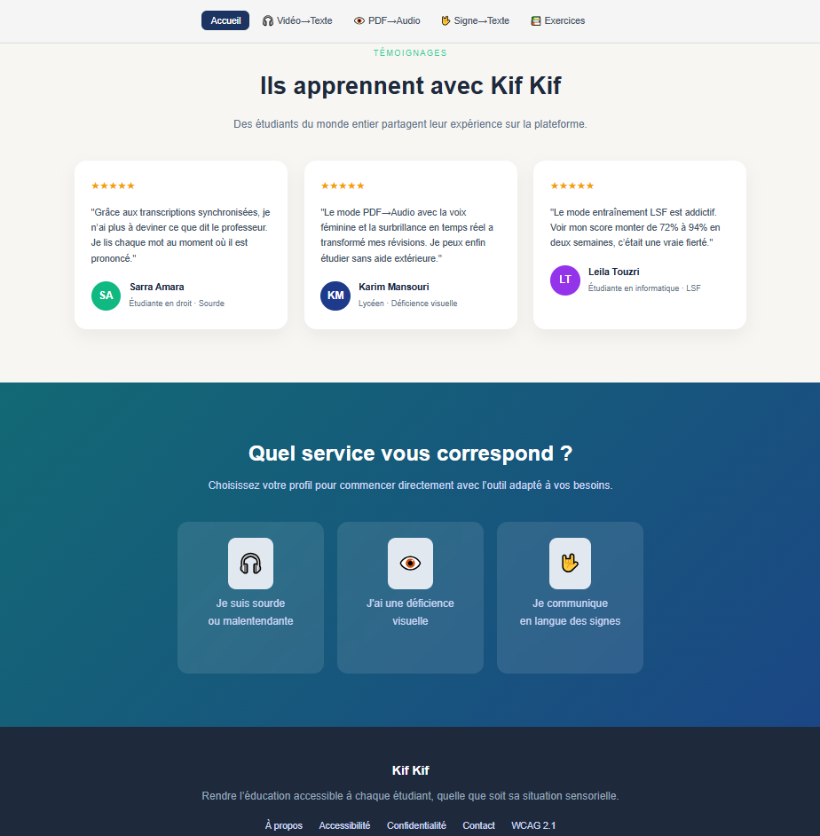
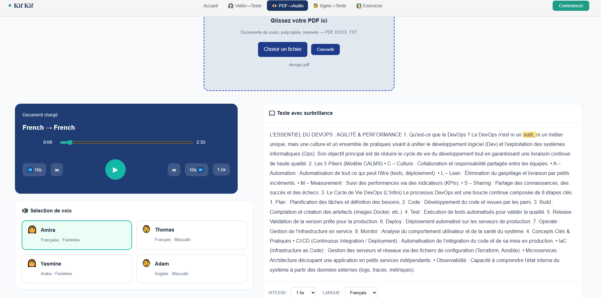
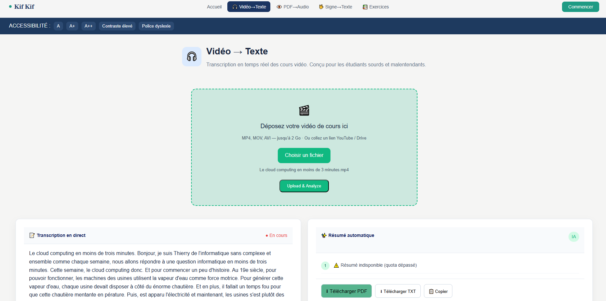
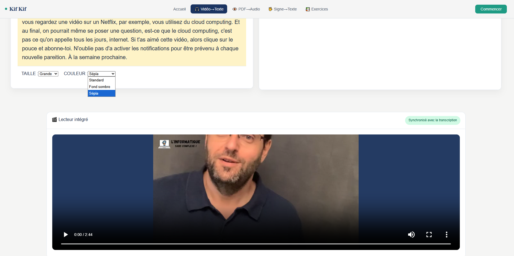
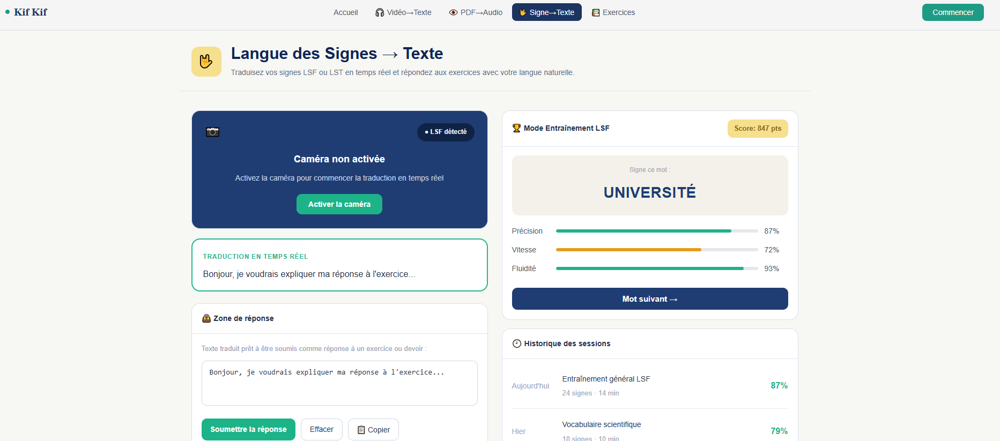
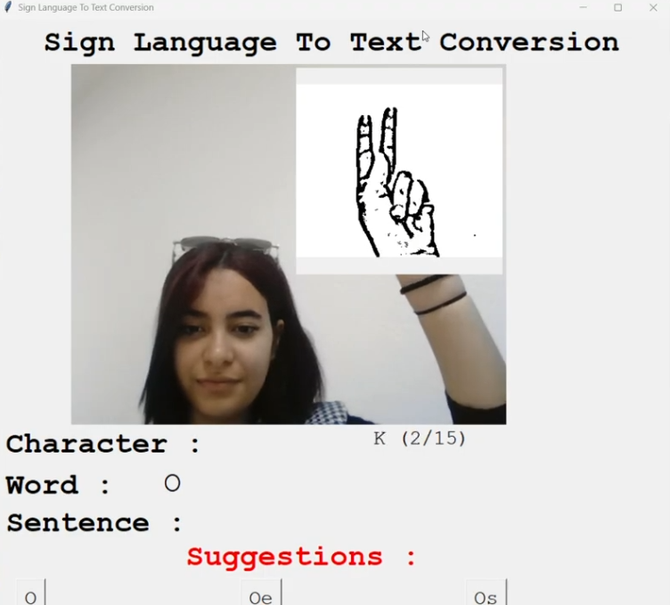
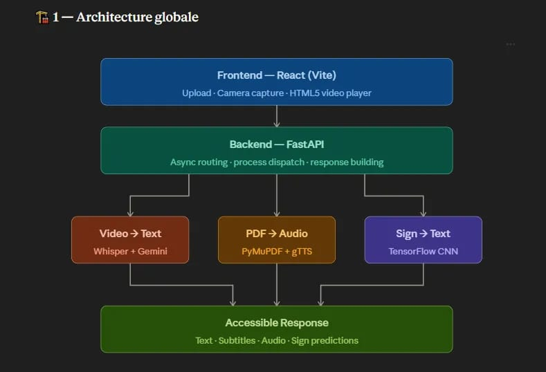
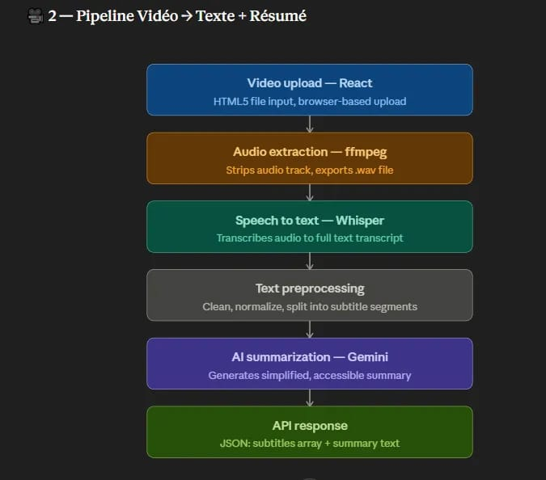
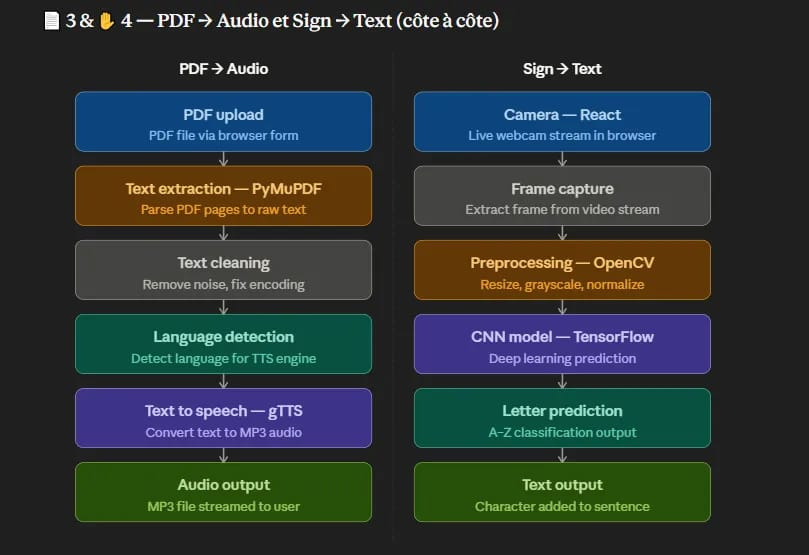
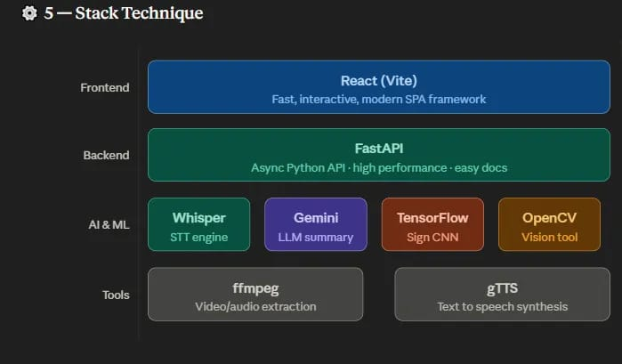

# Kif Kif AI 🎓🤖

**Kif Kif AI** is an intelligent accessibility platform designed to support inclusive education by helping people with disabilities interact with educational content in multiple formats (text, audio, and sign language).

## 🏠 Platform Interface



---

## 🎯 Problem & Motivation

In many educational systems, several major challenges exist:

* ❌ Early school dropout due to lack of adapted learning tools
* ❌ Difficulty for disabled students to integrate into traditional schools
* ❌ Lack of specialized teachers, especially for:

  * Sign language
  * Inclusive education
* ❌ Limited access to learning resources for:

  * Deaf and hard-of-hearing individuals
  * Visually impaired or blind users

---

## 💡 Our Solution

👉 **Kif Kif AI** aims to:

* Improve accessibility to education
* Encourage learning for all
* Provide intelligent tools powered by AI
* Reduce communication barriers

---

## 👥 Target Users

The platform is designed for:

### 🧏 Deaf & Hard-of-Hearing People

* Convert sign language → text
* Access video content through subtitles

### 👁️ Visually Impaired / Blind Users

* Convert PDF → audio
* Listen instead of reading

### 👨‍🎓 Students using Sign Language

* Learn and communicate through gestures

### 🎓 General Students

* Understand videos faster with summaries
* Convert content into easier formats

---

## 🚀 Features

---

### 📄 1. PDF → Audio

#### 🎯 Goal

Make documents accessible for visually impaired users.

#### ⚙️ Features

* Extract text from PDF
* Detect language automatically
* Translate content (multi-language)
* Convert text → speech (audio)

#### 👥 Who can use it?

* Blind users
* Students who prefer listening
* Language learners

### 📄 PDF → Audio



---

### 🎥 2. Video → Text + Summary

#### 🎯 Goal

Help users understand video content easily.

#### ⚙️ Features

* Extract audio from video (ffmpeg)
* Speech-to-text (Whisper AI)
* Automatic transcription
* AI-generated summary

#### 👥 Who can use it?

* Deaf users (subtitles)
* Students reviewing lessons
* Anyone who wants quick understanding

### 🎥 Video → Text




---

### ✋ 3. Sign Language → Text (In Progress)

#### 🎯 Goal

Enable communication using sign language.

#### ⚙️ Features

* Webcam capture
* Image preprocessing (OpenCV)
* Gesture recognition (CNN model)
* Convert signs → letters → text

#### 👥 Who can use it?

* Deaf users
* Sign language learners
* Communication assistance tools

### ✋ Sign Language → Text




---

## 🏗️ Technical Architecture

---

## 🏗️ Technical Architecture

---

### 🧩 Global Architecture



---

### 🎥 Video → Text Pipeline



---

### 📄 PDF & ✋ Sign Pipeline



---

### ⚙️ Tech Stack




---

## ⚙️ Tech Stack

### 🟢 Frontend

* React (Vite)
* Tailwind CSS

👉 Why?

* Fast UI
* Interactive
* Modern design

---

### 🔵 Backend

* FastAPI (Python)

👉 Why?

* High performance
* Async support
* Easy API integration

---

### 🧠 AI & Processing

* Whisper → Speech-to-Text
* TensorFlow / Keras → Sign recognition
* OpenCV → Image processing
* Gemini API → Text summarization

---

### 🟡 Tools

* ffmpeg → Audio extraction
* gTTS → Text-to-Speech

---

## ⚙️ Installation

### 🔹 Backend

```bash
cd backend
python -m venv .venv
.venv\Scripts\activate

pip install -r requirements.txt
uvicorn main:app --reload
```

---

### 🔹 Frontend

```bash
cd frontend
npm install
npm run dev
```

---

## 📦 Requirements

### Backend

```
fastapi
uvicorn
python-multipart
pydantic
numpy
opencv-python
pillow
tensorflow
keras
openai-whisper
ffmpeg-python
pypdf
PyMuPDF
gtts
google-generativeai
```

---

### Frontend

```
react
vite
axios
tailwindcss
```

---

## 🧠 AI Model

* CNN trained for sign language recognition
* Input: 128x128 grayscale image
* Output: A-Z + blank


---

## 📌 Notes

* `backend-sign` → experimental / in progress
* Gemini API requires active quota
* GPU not required (CPU works fine)

---

## 👨‍💻 Author

team Peaky blinders

---

## ⭐ Future Improvements

* Real-time sign detection
* Multi-language voice support
* AI-powered learning assistant
* Deployment (Docker / Cloud)

---

## 💬 Vision

> “Kif Kif AI aims to make education equal and accessible for everyone.”


